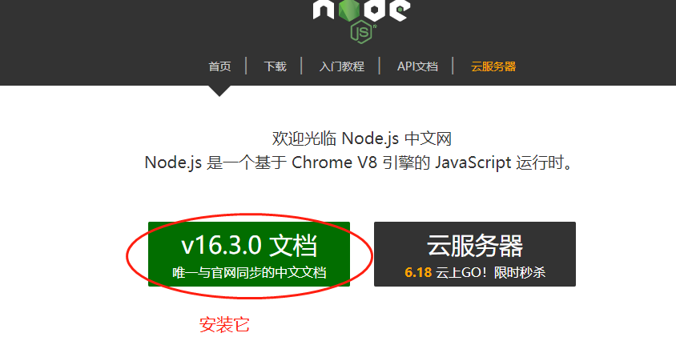

## 第一步

- 安装 node  node版本须大于14  安装地址[http://nodejs.cn/](http://nodejs.cn/)安装页面上的版本即可
- 下载对应你的系统的安装包

- 打开安装包,一直下一步到安装完成即可

## 填入你的cookie

- **inTimeActive** 和 **longActive** 里面的jdCookie.js填入你的cookie

- **修改助力码**
**inTimeActive** 和 **longActive** 里面的都要修改，改好一个文件夹复制到另一个就可以了

- 修改两个文件夹内含有sharecode名字js内的助力码为你自己的

## 运行脚本
 双击 **运行.bat**

以上脚本均搬运自第三方，有个别是加密代码，自行斟酌使用
